# DevHive

DevHive is the social network solution for programmers. In it you can make posts to share with your friends, comment and more.

It's built with [`ASP.NET Core`](https://docs.microsoft.com/en-us/aspnet/core/introduction-to-aspnet-core?view=aspnetcore-5.0) as a back-end and [`Angular`](https://angular.io/) as a front-end. For more technical information, you can refer to the [Wiki](https://github.com/Team-Kaleidoscope/DevHive/wiki).

## Contents:
- [Setting up locally](#setting-up-locally)
  - [Prerequisites](#prerequisites)
  - [Getting started with the database](#getting-started-with-the-database)
  - [Starting up the API](#starting-up-the-api)
  - [Starting up the Front-end](#starting-up-the-front-end)
  - [Important notes](#important-notes)
- [Screenshots](#screenshots)

## Setting up locally

There currently aren't any demo instances, so the only way to try it out for yourself it to set it up locally, on a computer or server. In this section are explained the steps to do so.

The steps are oriented around Linux-based systems.

### Prerequisites

There are some things you need to setup before even downloading the app.

Back-end (API) tools:
- [`dotnet 5.0`](https://docs.microsoft.com/en-us/dotnet/core/install/linux) or later
- [`Entity Framework Core tool 5.0.2`](https://docs.microsoft.com/en-us/ef/core/cli/dotnet) or greater
  - if you've already installed `dotnet`, you can just run this command `dotnet tool install dotnet-ef -g`
- [`postresql 13.1`](https://www.digitalocean.com/community/tutorials/how-to-install-and-use-postgresql-on-ubuntu-20-04) or greater (older versions might work, but haven't been tested)
  - Fedora users could also refer to [this](https://computingforgeeks.com/how-to-install-postgresql-12-on-fedora/) guide
  - Arch users can refer to the [ArchWiki](https://wiki.archlinux.org/index.php/PostgreSQL)

Front-end tools:
- [`Angular CLI 11.0.6`](https://www.tecmint.com/install-angular-cli-on-linux/) or greater (older versions might work, but haven't been tested)

### Getting started with the database

After installing all of the tools and setting up the database, you should have a user with a password with which to access postgres and you should have [created a database](https://www.tutorialspoint.com/postgresql/postgresql_create_database.htm) for the API. If so, follow these steps:

1. Clone the repository: `git clone https://github.com/Team-Kaleidoscope/DevHive.git`
2. Navigate to the folder, in which you cloned it, and then go to `src/DevHive.Data`
3. Edit the file `ConnectionString.json` and replace the default values with what you've setup
4. In the same directory, run `dotnet ef database update`

### Starting up the API

1. Navigate to the `src/DevHive.Web` folder
2. Edit the `appsettings.json` file, under "ConnectionStrings", type in the values, you setup in `ConnectionString.json` in `DevHive.Data`
   - On the third row there is a "Secret" field, it's used for encryption of User passwords, you can change it **but it must be made up of 64 letters and number!**
   - There are also some cloud values that you can change. Currently, the project uses [Cloudinary](https://cloudinary.com/) as a place for uploading files. If you wish, you can setup your own account there, otherwise file uploading won't work.
3. Run `dotnet run` in the `DevHive.Web` folder
   - feel free to [run the command in background](https://linuxize.com/post/how-to-run-linux-commands-in-background/) or [create a systemd service](https://medium.com/@benmorel/creating-a-linux-service-with-systemd-611b5c8b91d6)

If everything went well, you can now access the API on `http://localhost:5000/api` with something like [Postman](https://www.postman.com/) or the FOSS alternative [Insomnia Designer](https://github.com/Kong/insomnia). On where to send requests, refer to the [API Endpoints](https://github.com/Team-Kaleidoscope/DevHive/wiki/API-Endpoints) page in the Wiki.

### Starting up the Front-end

1. Navigate to `src/DevHive.Angular`
2. Run `npm install` to install all front-end packages
3. Run `ng serve` to start up the front-end
   - as with the API, you can [run the command in background](https://linuxize.com/post/how-to-run-linux-commands-in-background/) or [create a systemd service](https://medium.com/@benmorel/creating-a-linux-service-with-systemd-611b5c8b91d6)

If everything went smoothly, you will be able to access the front-end from `http://localhost:4200`. Also, don't forget that the API needs to be running *at the same time*, otherwise you won't get beyond the Login and Register pages!

### Important notes

You can change on what port the API is ran, by changing the `HTTP_PORT` constant in `src/DevHive.Web/Program.cs`. If you do so, you **must** also update the front-end, because by default it will try to send requests to `http://localhost:5000`. 
- Go to `src/DevHive.Angular/src/app` and edit the `app-constants.module.ts` file, on the second row you're gonna see the variable `BASE_API_URL`, change it accoring to your API modifications.

You can change on what port the front-end is ran, by issuing the serve command with the `--port` parameter: `ng serve --port 5001`. But, **don't run it with the `--ssl` parameter!** SSL isn't supported yet and you'll have issues trying to use it! If you really need ssl, using a [reverse proxy](https://www.cloudflare.com/learning/cdn/glossary/reverse-proxy/) might be a viable alternative.

## Screenshots

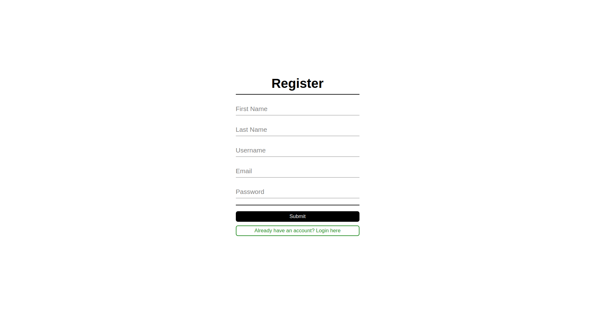
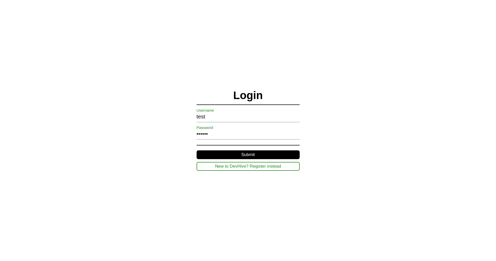
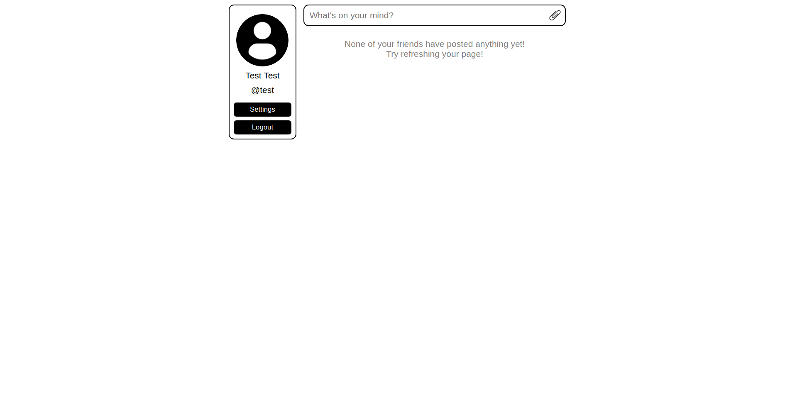
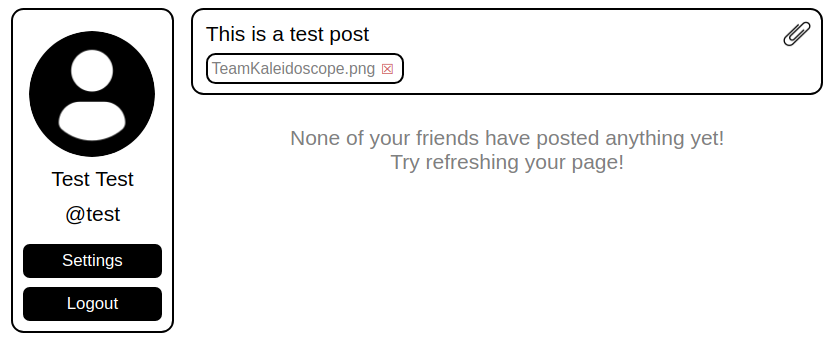
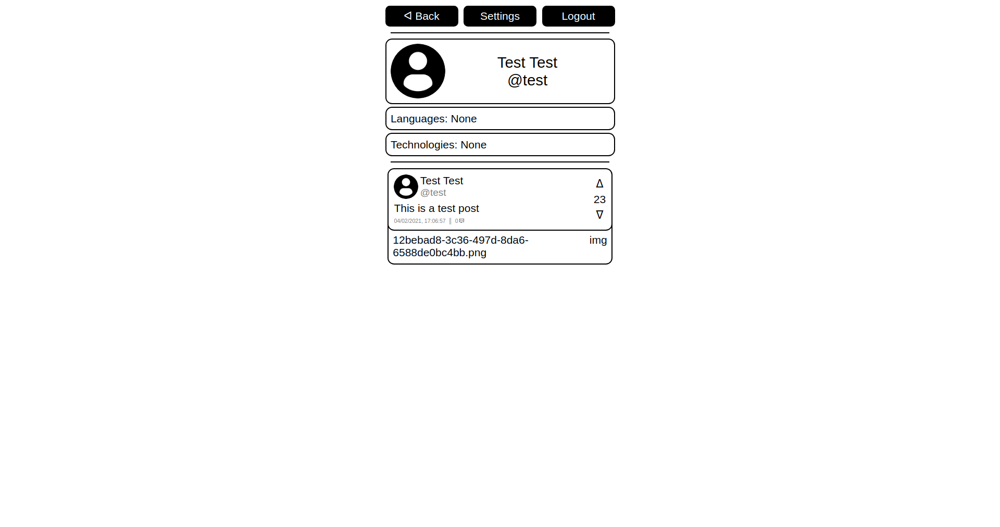
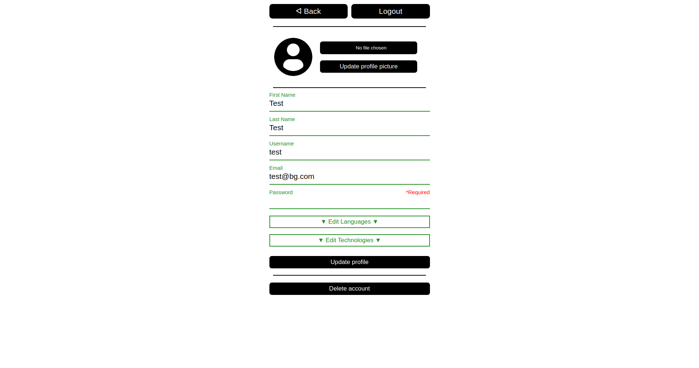
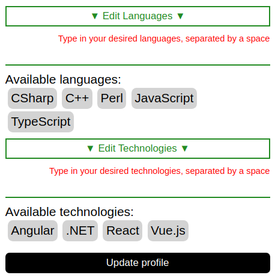
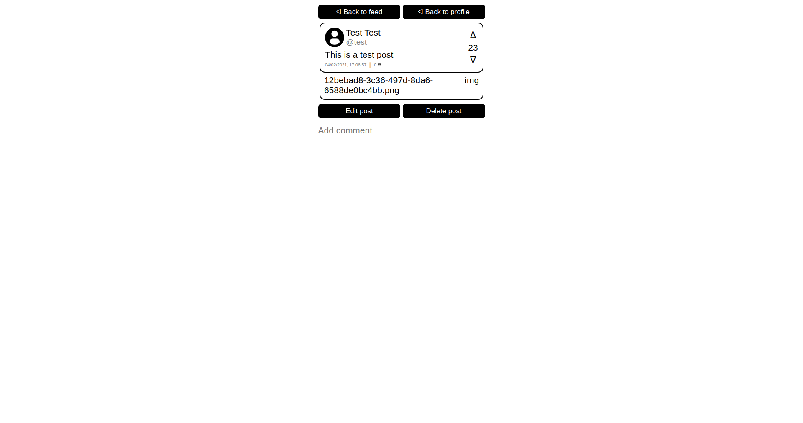
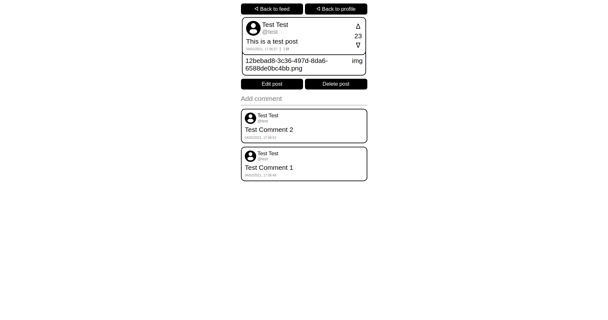
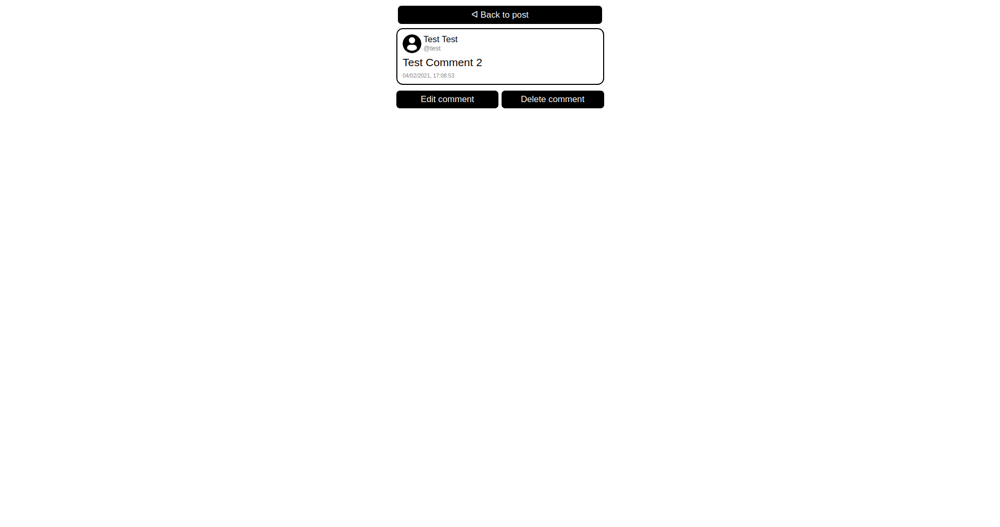
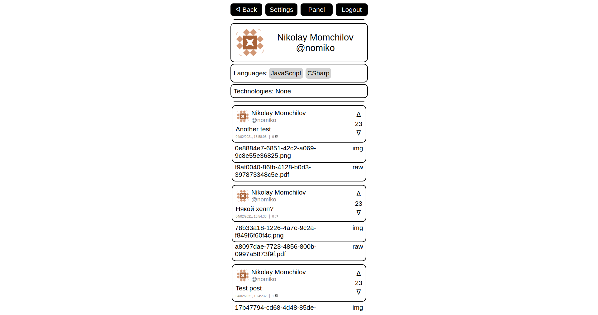
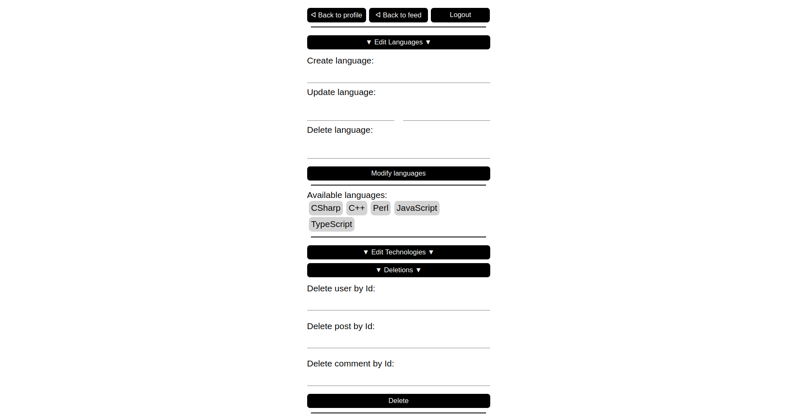
